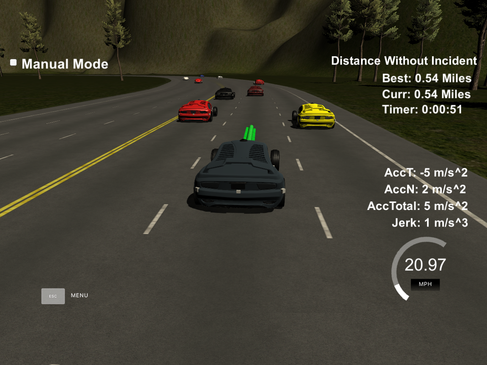
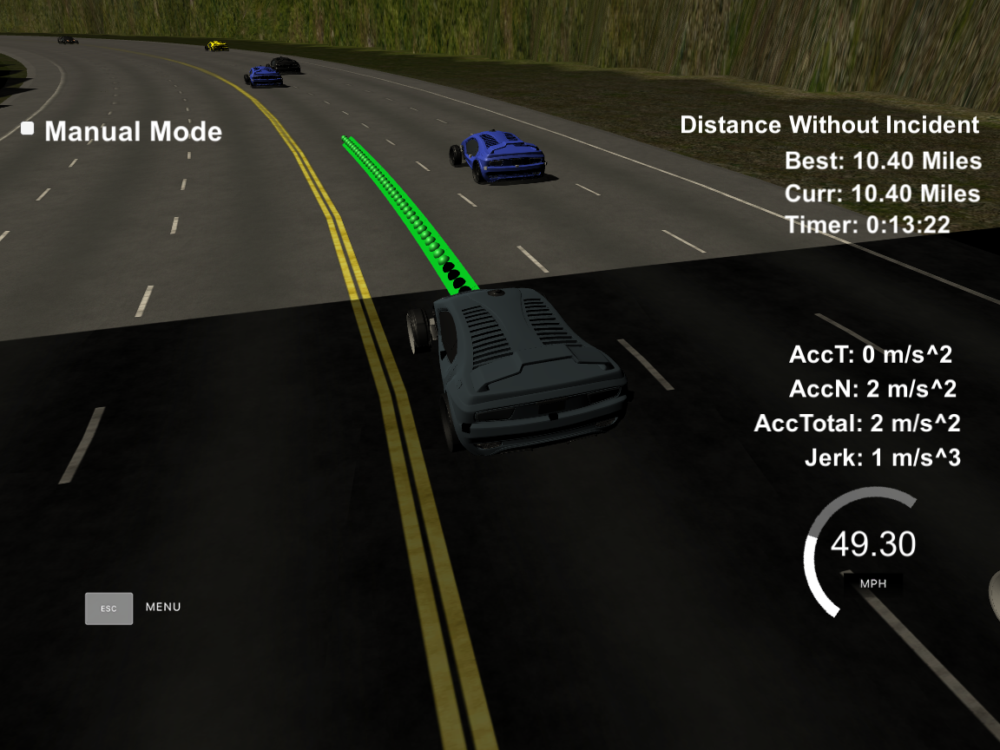
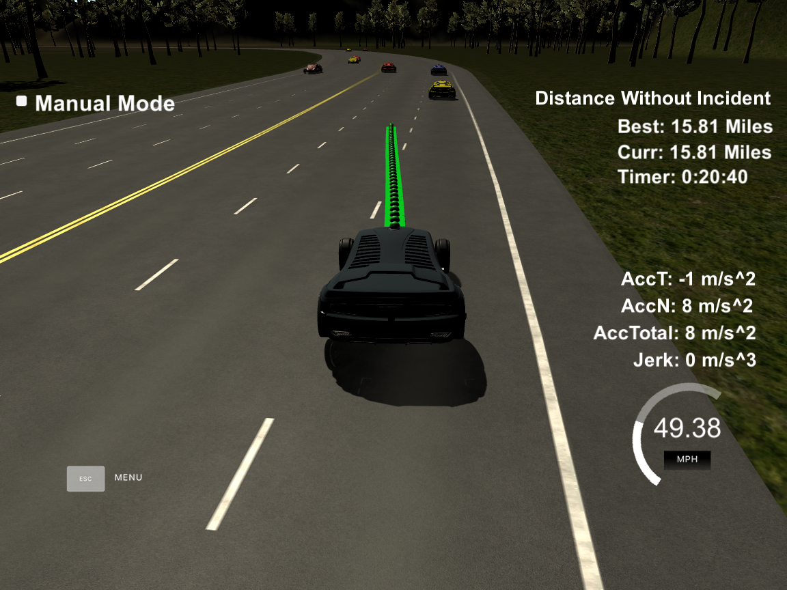

# CarND-Path-Planning
   
### Introduction

The goal of this project is to safely navigate the car around a virtual highway with other traffic that is driving +-10 MPH of the 50 MPH speed limit, given car's localization, sensor fusion data and a sparse map list of waypoints around the highway. The car should try to go as close as possible to the 50 MPH speed limit, which means passing slower traffic when possible, while other cars will try to change lanes too. The car should avoid hitting other cars at all cost as well as driving inside of the marked road lanes at all times, unless going from one lane to another. The car is required to be able to drive at least 4.32 miles while maintaing the speed limit and not exceeding a total acceleration of 10 m/s^2 and a jerk of 10 m/s^3.

A video of my vehicle making it further than the required distance can be seen [here](https://youtu.be/PwepF6I_oCo).Screenshots below shows the car was able to drive for 15 miles without any incident.







## Implementation

The implementation is divided into three parts:

1. Prediction

2. Behavior Planning

3. Trajectory Calculation

### Prediction

The lines 296-348 in main.cpp deals with telemetry and sensor fusion data to understand the cars environment. Three aspects of the data we are interested are if there is a car in front of our car, if there is a car in the left lane and if there is a car in the right lane.

This part of code is responsible to check if the distance between our car and a car infront and behind us is greater than 30 meters. If the distance is less than 30 meters, a lane change will be planned in the behavior.

### Behavior 

The lines 327-348 in main.cpp is responsible for planning the behavior of our car, whether to keep lane by increasing or decreasing the speed, change lane (left or right lane based on the predictions made) if there is a car infront of our car and is less than 30 meters distance.

Instead of increasing the speed here, a parameter speed_diff is created to be used for speed changes when generating the trajectory in the final part of the code. This makes the car more responsive acting faster to changing situations like a car in front of it trying to apply breaks to cause a collision.

### Trajectory

The final part is to make waypoints for the spline function. The lines 350-464 calculates the trajectory based on the speed and lane output from the behavior, car coordinates and previous path points.

First, the last two points of the previous trajectory (or the car position if there are no previous trajectory) are used in conjunction with three waypoints spaced 30 meters (lines 394-397 in main.cpp), too much shorter sometimes caused it to exceed maximum acceleration and maximum jerk. All these points are then shifted and rotated (lines 408-416 in main.cpp) so that they are local to my car. This helps to ensure the spline can work correctly, as the x-values need to be in order, and we want to them be correctly spaced out going forward.

After setting the spline, I used the spline to come up with new points along that spline. In order to ensure more continuity on the trajectory (in addition to adding the last two point of the pass trajectory to the spline adjustment), the pass trajectory points are copied to the new trajectory (lines 277 to 294). The rest of the points are calculated by evaluating the spline and transforming the output coordinates to non local coordinates (lines 434 to 463). The change in the velocity of the car is handled in the lines 436-442. The speed change is decided in the behavior part of the code (lines 328-348), but it is used in that part to increase/ or decrease speed on every trajectory points instead of doing it for the complete trajectory.

#### The map of the highway is in data/highway_map.txt
Each waypoint in the list contains  [x,y,s,dx,dy] values. x and y are the waypoint's map coordinate position, the s value is the distance along the road to get to that waypoint in meters, the dx and dy values define the unit normal vector pointing outward of the highway loop.

The highway's waypoints loop around so the frenet s value, distance along the road, goes from 0 to 6945.554.

## Basic Build Instructions

1. Clone this repo.
2. Make a build directory: `mkdir build && cd build`
3. Compile: `cmake .. && make`
4. Run it: `./path_planning`.

Here is the data provided from the Simulator to the C++ Program

#### Main car's localization Data (No Noise)

["x"] The car's x position in map coordinates

["y"] The car's y position in map coordinates

["s"] The car's s position in frenet coordinates

["d"] The car's d position in frenet coordinates

["yaw"] The car's yaw angle in the map

["speed"] The car's speed in MPH

#### Previous path data given to the Planner

//Note: Return the previous list but with processed points removed, can be a nice tool to show how far along
the path has processed since last time. 

["previous_path_x"] The previous list of x points previously given to the simulator

["previous_path_y"] The previous list of y points previously given to the simulator

#### Previous path's end s and d values 

["end_path_s"] The previous list's last point's frenet s value

["end_path_d"] The previous list's last point's frenet d value

#### Sensor Fusion Data, a list of all other car's attributes on the same side of the road. (No Noise)

["sensor_fusion"] A 2d vector of cars and then that car's [car's unique ID, car's x position in map coordinates, car's y position in map coordinates, car's x velocity in m/s, car's y velocity in m/s, car's s position in frenet coordinates, car's d position in frenet coordinates. 

## Details

1. The car uses a perfect controller and will visit every (x,y) point it recieves in the list every .02 seconds. The units for the (x,y) points are in meters and the spacing of the points determines the speed of the car. The vector going from a point to the next point in the list dictates the angle of the car. Acceleration both in the tangential and normal directions is measured along with the jerk, the rate of change of total Acceleration. The (x,y) point paths that the planner recieves should not have a total acceleration that goes over 10 m/s^2, also the jerk should not go over 50 m/s^3. (NOTE: As this is BETA, these requirements might change. Also currently jerk is over a .02 second interval, it would probably be better to average total acceleration over 1 second and measure jerk from that.

2. There will be some latency between the simulator running and the path planner returning a path, with optimized code usually its not very long maybe just 1-3 time steps. During this delay the simulator will continue using points that it was last given, because of this its a good idea to store the last points you have used so you can have a smooth transition. previous_path_x, and previous_path_y can be helpful for this transition since they show the last points given to the simulator controller with the processed points already removed. You would either return a path that extends this previous path or make sure to create a new path that has a smooth transition with this last path.

## Tips

A really helpful resource for doing this project and creating smooth trajectories was using http://kluge.in-chemnitz.de/opensource/spline/, the spline function is in a single hearder file is really easy to use.

---

## Dependencies

* cmake >= 3.5
  * All OSes: [click here for installation instructions](https://cmake.org/install/)
* make >= 4.1
  * Linux: make is installed by default on most Linux distros
  * Mac: [install Xcode command line tools to get make](https://developer.apple.com/xcode/features/)
  * Windows: [Click here for installation instructions](http://gnuwin32.sourceforge.net/packages/make.htm)
* gcc/g++ >= 5.4
  * Linux: gcc / g++ is installed by default on most Linux distros
  * Mac: same deal as make - [install Xcode command line tools]((https://developer.apple.com/xcode/features/)
  * Windows: recommend using [MinGW](http://www.mingw.org/)
* [uWebSockets](https://github.com/uWebSockets/uWebSockets)
  * Run either `install-mac.sh` or `install-ubuntu.sh`.
  * If you install from source, checkout to commit `e94b6e1`, i.e.
    ```
    git clone https://github.com/uWebSockets/uWebSockets 
    cd uWebSockets
    git checkout e94b6e1
    ```
